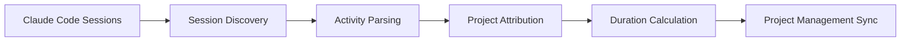

# Smart Work Tracker — AI Session Time Tracking


Automated pipeline that discovers Claude Code CLI sessions, parses activity, attributes time to billable projects, and syncs hours to project management tools.

---

## The Problem

AI-assisted development creates billing blind spots:
- When an AI agent works across 10 projects in one session, how do you attribute time correctly?
- Manual time tracking misses work
- AI sessions blur project boundaries
- Hours logged don't match actual work performed

---

## The Solution

Automatic discovery and processing of Claude Code CLI sessions into billable time records.



---

## How It Works

1. **Session Discovery** — Scans for new Claude Code CLI session logs
2. **Activity Parsing** — Extracts tool calls, file edits, conversation context
3. **Project Attribution** — Maps file paths to billable projects
4. **Duration Calculation** — Removes idle gaps, calculates adjusted time
5. **PM Sync** — Creates time entries in project management system

---

## Key Features

- **Auto-discovers** CLI sessions from log files (including subagents)
- **Growing session detection** — reprocesses files when they change
- **Work segmentation** — breaks sessions into billable segments
- **Project attribution** — matches work via directory and context
- **Privacy protection** — redacts sensitive data before storage
- **Cron-automated** daily processing
- **Catches billing discrepancies** — found 30min vs 9hr gaps

---

## Tech Stack

| Category | Technologies |
|----------|-------------|
| **Runtime** | Node.js |
| **Database** | SQLite (better-sqlite3) |
| **Scheduling** | Cron |
| **Integration** | REST API |

---

## Results

- Processes **62+ sessions** automatically
- Catches billing discrepancies saving hours of manual reconciliation
- Daily cron ensures no work goes untracked
- Identified gaps where 30min logged vs 9hr actual work

---

## Usage

```bash
# Check today's sessions
node check-today.js

# Check this week
node check-week.js

# Check unbilled hours
node check-unbilled-hours.js

# Approve and submit to PM
node approve-and-submit.cjs
```

---

## Configuration

```bash
# Project management API
PM_API_URL=https://api.example.com
PM_API_TOKEN=xxx

# Path to session logs
SESSION_LOG_PATH=~/.claude/sessions
```

---

## License

MIT
